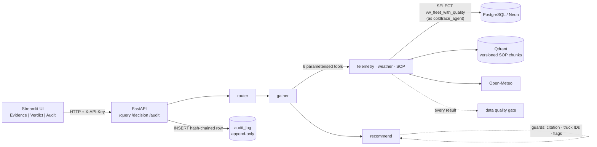

# ColdTrace

An AI copilot for cold-chain dispatchers that shows its evidence before it recommends anything.

Design, scope and build plan: [`docs/DESIGN.md`](docs/DESIGN.md).

## Architecture



The agent never writes SQL: it picks one of six tools and supplies validated arguments.
Every reading passes the data quality gate before the model sees it. The recommend node
sees only the question and the evidence, and its verdict is checked by code before it is
returned. Every question and every dispatcher decision is one hash-chained audit row.

## Setup

```bash
uv sync
cp .env.example .env              # fill in DATABASE_URL (Neon)
git config core.hooksPath .githooks
uv run python -m scripts.generate_data   # deterministic synthetic fleet -> data/synthetic/
uv run python -m scripts.setup_db        # schema, view, roles, grants
uv run python -m scripts.ingest_telemetry  # load CSVs as coldtrace_admin
```

The generated fleet has fixed timestamps (72 hours ending 2026-10-01 00:00 UTC) so it is
reproducible. The ingest script shifts all timestamps so the most recent reading lands at
ingest time; faults keep their relative timing. Re-run `scripts/ingest_telemetry.py` to
refresh the demo data window.

The database is Neon's free tier, which suspends compute after 5 minutes idle. The first
query after a pause takes 1–2 seconds longer while it wakes; that is expected, not a fault.

## Ask a question

```bash
uv run python -m scripts.ingest_sop_qdrant   # SOP -> local Qdrant (once)
uv run python -m scripts.ask --replay "Find any trucks near Los Angeles with temperature problems and tell me what to do."
```

Prints the evidence (gather node) and the verdict (recommend node) separately, then the
audit row and whether the hash chain verifies. `--replay` sets the clock to the newest
reading in the database (or set `CLOCK_MODE=replay` in `.env`); without it, a fleet
loaded more than 15 minutes ago is correctly flagged STALE_FEED everywhere.

The LLM is local Ollama (`qwen2.5:7b`) by default; set `LLM_PROVIDER=deepseek` with
`DEEPSEEK_API_KEY` and `DEEPSEEK_MODEL` to use DeepSeek.

## HTTP API

```bash
uv run uvicorn api.main:app --reload        # interactive docs at http://localhost:8000/docs
```

```bash
curl -X POST localhost:8000/query -H "Content-Type: application/json"      -d '{"question": "Any trucks near Los Angeles with temperature problems?"}'
# -> session_id, log_id, evidence, verdict, sop_cited, confidence, data_quality_flags, token_counts

curl -X POST localhost:8000/decision -H "Content-Type: application/json"      -d '{"log_id": 3, "decision": "overridden", "reason": "Driver already at depot"}'

curl "localhost:8000/audit?tool_name=get_truck_telemetry&decision=overridden&limit=20"
curl localhost:8000/audit/verify
```

## Dispatcher UI

```bash
uv run uvicorn api.main:app                  # terminal 1: the API
uv run streamlit run ui/app.py               # terminal 2: the UI (API_URL defaults to :8000)
```

Cost per query is shown when `LLM_PRICE_IN_PER_MTOK` and `LLM_PRICE_OUT_PER_MTOK` are set
(USD per million tokens, from the provider's pricing page); a local Ollama model shows $0.

## Deploy (Render free tier)

`render.yaml` defines two web services, `coldtrace-api` and `coldtrace-ui`.

1. **Database, once, from your machine** (as the Neon owner, in `.env`):
   `uv run python -m scripts.setup_db`, then `uv run python -m scripts.ingest_telemetry`.
2. **Push the repo to GitHub**, then in Render: *New → Blueprint* → pick the repo.
3. Render asks for the secrets:
   - `DATABASE_URL` — the **coldtrace_agent** URL, not the owner URL:
     `postgresql://coldtrace_agent:<COLDTRACE_AGENT_PASSWORD>@<neon-host>/<db>?sslmode=require`.
     The API only ever connects as the agent role, so the owner password never reaches Render.
   - `COLDTRACE_AGENT_PASSWORD`, `DEEPSEEK_API_KEY`, `DEEPSEEK_MODEL`.
   - `API_URL` (UI) — the API's public URL once it exists, e.g. `https://coldtrace-api.onrender.com`.
   - `UI_PASSWORD` (optional) and the two `LLM_PRICE_*` values (for cost per query).
   `API_KEY` is generated by Render and shared with the UI automatically.
4. Local Ollama cannot run on Render; the deploy uses DeepSeek.

Free-tier behaviour to expect: services sleep after 15 minutes idle, so the first request
takes up to a minute (the API also re-downloads the embedding model and rebuilds the 8 SOP
chunks in memory on each start). Neon's compute also sleeps (1–2 s wake). The API uses
about 330 MB of the 512 MB limit at rest.

## Checks

```bash
uv run ruff check . && uv run ruff format --check . && uv run mypy && uv run pytest
```
